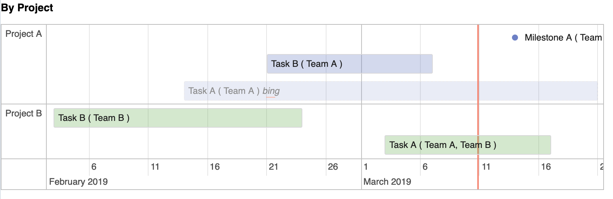

# Overview

The project helps you create and embed beautiful roadmaps with a simple, readable syntax.

[](https://travis-ci.org/catacgc/roadmap-builder)

# Where to use it

Any place that accepts some scripts and some html tags

# Documentation

Full docs are here: https://catacgc.github.io/roadmap-builder/

## Teaser

This is what you get by embedding the following snippet:

```
<script src="https://catacgc.github.io/roadmap-builder/main.bundle.js"></script>
<div class="roadmap" style="width: 800px; font-size: 12px">
        Project A, Milestone A
        2019-01-10 + 9w
        Team A

        Project A, Task A
        2019-01-10 + 5w, 5w
        Team A

        Project A, Task B
        2019-01-10 + 6w, 2w
        Team A

        Project B, Task A
        2019-01-20 + 6w, 2w
        Team A, Team B
    </div>
```



# Development

This project is a playground for Kotlin JS + React .
All you will need to do is to open it in IDEA and you are good to go.

Run `./gradlew build -t` to start the compile process that continuously compiles kotlin2js.

Run `./gradlew webpackDevServer` to start the webpack server that refreshes the browser and provides error info.

Edit `src/main/resources/index.html` (this doc) to see changes in realtime.
